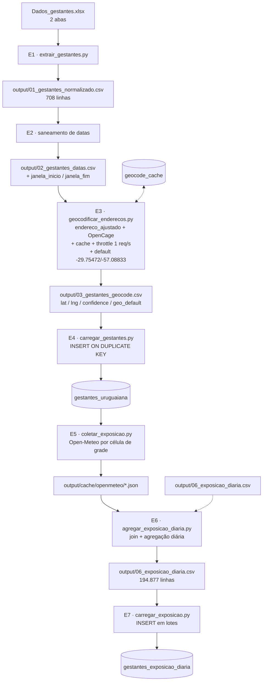

# Planejamento — Pipeline Gestantes Uruguaiana/RS

> Ingestão de `Dados_gestantes.xlsx` → geocodificação (OpenCage) → exposição ambiental
> (Open-Meteo: PM10, PM2.5 e temperatura) → MySQL `datasaude`.

**Data do planejamento:** 2026-09-17
**Arquivo de entrada:** `/Users/cauebeloni/Documents/Projeto Pensi/dados/uruguaiana-rs/Dados_gestantes.xlsx`
**Destino:** MySQL 8.0.37 (`datasaude`) via `core/database.py`
**Documentos relacionados:** `create_table_gestantes_uruguaiana.sql`, `create_table_gestantes_exposicao_diaria.sql`, `create_table_geocode_cache.sql`

---

## 1. Objetivo

1. Ler as **2 abas** do arquivo Excel e unificar em um único conjunto de gestantes.
2. Acrescentar uma **coluna de grupo** identificando a aba de origem de cada registro.
3. Criar uma **nova coluna de endereço** (`endereco_ajustado`), corrigindo os
   preenchimentos incorretos e padronizando o município.
4. **Geocodificar** o endereço via API OpenCage, persistindo `latitude`, `longitude`,
   `confidence` e `formatted`. Quando não houver endereço ou ele não for resolvível,
   usar a **coordenada default `-29.75472 / -57.08833`** (centroide de Uruguaiana).
5. Para cada registro, recuperar os **9 meses de exposição** imediatamente anteriores
   à data de referência: `pm10`, `pm2_5` (Open-Meteo Air Quality) e `temperature_2m`
   (Open-Meteo Archive), **agregados por dia**.
6. Persistir em duas tabelas relacionadas no MySQL.

---

## 2. Diagnóstico do arquivo de entrada

### 2.1 Estrutura

| Aba | Registros | ID | Coluna do endereço |
|---|---|---|---|
| `Grupo1` | 504 | `Form1_1` … `Form1_504` | `Localização/endereço` |
| `Grupo_2` | 204 | `Form2_1` … `Form2_204` | `Endereço/localização` |
| **Total** | **708** | | |

Ambas as abas têm exatamente 4 colunas, na mesma ordem, mas com **cabeçalhos
diferentes na 4ª coluna** — é obrigatório ler por **posição** (ou mapear os nomes),
nunca concatenar por nome de coluna.

| # | `Grupo1` | `Grupo_2` | Tipo |
|---|---|---|---|
| 0 | `ID_Gestantes` | `ID_Gestantes` | texto (`FormN_M`) |
| 1 | `Carimbo de data/hora` | `Carimbo de data/hora` | datetime (submissão) |
| 2 | `Data da Coleta: ` | `Data da Coleta: ` | data mista (**há sujeira**) |
| 3 | `Localização/endereço` | `Endereço/localização` | texto livre (**há sujeira**) |

### 2.2 Qualidade dos endereços

| Métrica | Valor |
|---|---|
| Total de registros | 708 |
| Sem endereço utilizável | **154** (21,8%) |
| Com endereço | 554 |
| Endereços únicos utilizáveis | **548** (547 após normalização) |

Valores que devem ser tratados como “sem endereço” (comparação em maiúsculas, com `strip`):

| Valor literal | Ocorrências |
|---|---|
| `NÃO APARECE NO CELK` | 133 |
| `SEM ENDEREÇO` | 16 |
| `SEM DADOS RECENTES` | 3 |
| `nan` / vazio | 2 |

Outras observações sobre os endereços:

- **Nenhum registro contém CEP.** O CEP terá de vir do retorno do OpenCage.
- 14 endereços **não citam Uruguaiana** — são bairros/loteamentos do próprio município
  (`Ipiranga`, `Tabajara Brites`, `Cabo Luís Quevedo`, `União das Vilas`, `São João`,
  `Nova Esperança`, `Cidade Nova`, `Proficar`, `Barragem Sanchuri`…). Pela decisão de
  projeto (§3), **todos os endereços são do município de Uruguaiana/RS**: o município
  é sempre anexado de forma padronizada e menções a municípios vizinhos são removidas.
- Vários endereços são referências de loteamento rural (`QUADRA G, 601`, `RODOVIA BR-472 581/581`,
  `QUADRA DEZ, 24`) — teste real (§2.7) confirmou que **não são geocodificáveis** e caem
  no centroide do município com `confidence = 7`.
- Diferenças de grafia: `URGUAIANA` (typo), `RUA RUA MARECHAL DEODORO` (duplicação),
  separadores mistos (`.`, `-`, `;`).

### 2.3 Qualidade das datas (`Data da Coleta: `)

O campo é `object` no pandas (mistura `datetime` e `str`) → **exige `errors="coerce"`**.

| ID | Valor registrado | Carimbo (submissão) | Problema | Correção |
|---|---|---|---|---|
| `Form1_59` | `1/8/1024` | 2024-02-09 | ano inválido (não parseia) | ano `1024` → `2024`; divirge > 30 d do carimbo → usar carimbo |
| `Form1_120` | `3024-03-25` | 2024-03-25 | ano inválido (não parseia) | ano `3024` → `2024` (= carimbo ✔) |
| `Form2_199` | `2004-06-01` | 2025-06-01 | ano fora da faixa | divergência de 7.670 d → usar carimbo |
| `Form1_64` | 2023-02-10 | 2024-02-10 | −365 d | usar carimbo |
| `Form1_149` | 2023-04-06 | 2024-04-06 | −366 d | usar carimbo |
| `Form2_23`, `Form2_24` | 2024-02-23 | 2025-02-23 | −366 d | usar carimbo |
| `Form2_39`, `Form2_53`, `Form2_76` | 2024-03-* | 2025-03-* | −365 d | usar carimbo |
| `Form1_104` | 2024-09-20 | 2024-03-20 | +184 d | usar carimbo |
| `Form1_426` | 2024-05-06 | 2024-11-06 | −184 d | usar carimbo |
| `Form1_262` | 2024-03-04 | 2024-06-04 | −92 d | usar carimbo |
| `Form1_315` | 2024-04-23 | 2024-07-23 | −91 d | usar carimbo |
| `Form1_222`, `Form1_247` | 2024-06-* | 2024-05-* | +31 d | usar carimbo |
| `Form1_344/345/347`, `Form1_419`, `Form2_18`, `Form2_122` | — | — | ±31 d | usar carimbo |

**Resumo da aplicação das regras** (tolerância = **30 dias**):

| `data_status` | Registros |
|---|---|
| `OK` | **686** |
| `FALLBACK_CARIMBO` | **21** |
| `CORRIGIDA` | **1** (`Form1_120`: `3024-03-25` → `2024-03-25`) |
| `INVALIDA` | 0 |
| **Total com `data_status <> 'OK'`** | **22** (3,1%) |

> A tolerância de 30 dias é um parâmetro (`TOLERANCIA_DIAS`) e também captura os casos
de **±31 dias** (artefato de comprimento de mês, ex.: `07/06` vs `07/05`). Optou-se por
manter 30 dias: o `Carimbo` é sempre confiável e a data de coleta é apenas a âncora da
janela — um desvio de um mês deslocaria toda a exposição do registro.

Faixa final de `data_referencia`: **2023-08-02 → 2025-06-01**.

### 2.4 Cobertura das APIs (verificado em 2026-09-17)

| API | Início histórico | Fim | Observação |
|---|---|---|---|
| Air Quality (CAMS) | **~2022-07-29** | atual | antes disso retorna `null` (HTTP 200) |
| Archive (ERA5) | 1940 | D−5 | cobertura total no período |

**Impacto real após o saneamento de datas: ZERO.**

A primeira versão deste planejamento apontava 2 registros (`Form1_64`, `Form1_149`) com
janela iniciando antes da cobertura do CAMS. Porém, ambos são casos de
`FALLBACK_CARIMBO` (§2.3): ao substituir a data de coleta pelo carimbo, suas janelas
passam a **2023-05-10 → 2024-02-10** e **2023-07-06 → 2024-04-06**.

A janela mais antiga de todo o estudo passa a ser **2022-11-02**, confortavelmente
dentro da cobertura do CAMS. O risco R4 está **eliminado**.

### 2.5 Timezone — ponto crítico

Os JSONs de referência em `dados/uruguaiana-rs/` demonstram o problema:

| Arquivo | `utc_offset_seconds` | `timezone` |
|---|---|---|
| `poluicao.json` | `0` | **GMT** ← requisição sem `timezone` |
| `temperatura.json` | `-10800` | America/Sao_Paulo |

Sem o parâmetro `timezone`, a **Air Quality API devolve horários em GMT** e a Archive
em GMT também. Misturar as duas séries produziria **desalinhamento de 3 horas** na
agregação diária (e ~3 dias de borda errados no início/fim da janela).

> **Decisão obrigatória:** enviar `timezone=America%2FSao_Paulo` em **todas** as
> chamadas Open-Meteo. A API devolve `utc_offset_seconds: -10800` e horários locais.

### 2.6 Bloqueios identificados

| # | Bloqueio | Status | Ação necessária |
|---|---|---|---|
| ~~B1~~ | ~~Chave OpenCage inválida~~ | ✅ **RESOLVIDO** | `.env` agora tem `OPENCAGE_API_KEY` válida — testada em 2026-09-18: HTTP 200, `limit: 2500` |
| ~~B2~~ | ~~`.env` sem a chave~~ | ✅ **RESOLVIDO** | Variável correta é **`OPENCAGE_API_KEY`** (maiúsculas) |
| B3 | A aba `Grupo_2` estava aberta no Excel (`.~lock.Dados_gestantes.xlsx#`) | ⚠️ Pendente | Fechar o arquivo antes de executar |

---

### 2.7 Teste real de geocodificação (amostra de 50 endereços, 2026-09-18)

Foi executada uma amostra aleatória de **50 dos 547 endereços únicos** para medir o
comportamento real da API. Resultado:

| Classificação | Qtd. | % | Comportamento |
|---|---|---|---|
| **Resolvido no logradouro** | 22 | **44%** | `confidence` 8–9, coordenadas reais do bairro |
| **Fallback para o centroide** | 28 | **56%** | `confidence` **7** (enganoso!), coordenadas = centroide |
| Não encontrado | 0 | 0% | — |
| Erro de API | 0 | 0% | — |

#### Descoberta 1 — `confidence = 7` não significa sucesso

Todos os 28 fallbacks retornaram **exatamente** `-29.754720, -57.088330` — o centroide
do município — com `confidence = 7`. Ou seja, **confiança isolada não distingue um
endereço resolvido de um chute no centroide da cidade**.

O sinal que distingue é o campo `components._type`:

| Caso | `_type` | `_category` | `road` | coords |
|---|---|---|---|---|
| Resolvido | `road` | `road` | `Rua General Propicio` | reais do bairro |
| Centroide | `city` | `place` | `None` | `-29.754720, -57.088330` |

> **O default informado pelo usuário (`-29.75472, -57.08833`) é exatamente o centroide
> do município devolvido pela OpenCage.** Isso torna a decisão "usar o default quando o
> endereço não estiver disponível" naturalmente coerente com o próprio fallback da API.

#### Descoberta 2 — resultados em municípios errados

3 dos 50 casos retornaram `-32.035000, -52.098610` — **Rio Grande/RS, a ~250 km de
distância** — com `confidence = 5`. Casos: `RUA DOUTOR HOMERO TARRAGO 1/99998, 1330`,
`RUA DOMINGOS DE ALMEIDA 1002/1640, 1232`, `GRANJA BR 472, PAS DA CRUZ, 991`.

Nenhuma checagem de `confidence` pegaria isso. É obrigatório validar as coordenadas
contra o **bounding box de Uruguaiana** (obtido da própria OpenCage):

```
lat  -30.2050473  →  -29.4001025
lng  -57.3290000  →  -56.1502443
```

#### Descoberta 3 — resultado real da execução completa (547 endereços)

Após a execução da Etapa 3 em 2026-09-18 (899 s, quota 2500 → 1970):

| `geo_status` | Registros | `geo_default` | Significado |
|---|---|---|---|
| `CENTROIDE_MUNICIPIO` | **287** | 1 | Não resolvido no logradouro → usa o default |
| `OK` | **232** | 0 | Resolvido no logradouro (conf ≥ 8, `_type = road`) |
| `SEM_ENDERECO` | **154** | 1 | `NÃO APARECE NO CELK` / `SEM ENDEREÇO` / vazio |
| `FORA_DO_MUNICIPIO` | **24** | 1 | Bbox rejeitou (evitou resultados a 250 km) |
| `BAIXA_CONFIANCA` | **9** | 0 | Dentro do bbox, `_type` de logradouro, confiança < 8 |
| `NAO_ENCONTRADO` | **2** | 1 | API não retornou resultado |
| **Total** | **708** | **467** | 66% usam o centroide |

Efeito colateral positivo da regra 5 (§E3.1): remover o município vizinho do texto
**converteu endereços irresolvíveis em resolvíveis**. Exemplo real:

| `endereco_original` | `endereco_ajustado` | Antes | Depois |
|---|---|---|---|
| `RUA ESPINILHO, 15; BARRA DO QUARAÍ, RS` | `RUA ESPINILHO, 15, URUGUAIANA, RS, BRASIL` | centroide (7) | **logradouro (9)** |

> **Consequência analítica:** 467 das 708 gestantes (66%) compartilham **exatamente
a mesma coordenada** e, portanto, **a mesma série de exposição**. A coluna
`geo_default` permite medir a sensibilidade do estudo excluindo esse subconjunto.
> Isso também torna a deduplicação por célula de grade (§E5) ainda mais eficaz: as
467 gestantes caem em pouquíssimas células.
>
> **Atenção:** `BAIXA_CONFIANCA` (9 registros) mantém a coordenada real, dentro do
> município — serve como estimativa melhor que o centroide.

---

## 3. Decisões de projeto (validadas com o usuário)

| Tema | Decisão |
|---|---|
| **Janela temporal** | 9 meses **antes** da data de coleta: `[data_referencia − 9 meses, data_referencia]`, **inclusiva nas duas pontas** (274–277 dias) |
| **Granularidade** | **Diária agregada** — 1 linha por (gestante, dia) |
| **Data-âncora** | `Data da Coleta` com saneamento; fallback em `Carimbo de data/hora` |
| **Registros sem endereço** | **São inseridos**, usando as coordenadas default |
| **Destino** | MySQL do projeto (`.env`) |
| **Chave da API** | Variável `OPENCAGE_API_KEY` do `.env` (nunca hardcoded) |
| **Coordenada default** | **`-29.75472` / `-57.08833`** (centroide de Uruguaiana), usada sempre que não houver coordenada válida. Sinalizada por `geo_default = 1` |
| **Município** | **Todos os endereços são de Uruguaiana/RS** — o município é sempre anexado padronizado e menções a outros municípios são removidas |
| **Nova coluna de endereço** | `endereco_ajustado` — versão corrigida do endereço, somada a `endereco_original` (cru) e `endereco_ajuste` (o que foi corrigido) |

**Consequência da granularidade diária:** **708 registros × ~275 dias = 194.877 linhas**
em `gestantes_exposicao_diaria` (todas as gestantes têm coordenada, inclusive as sem
endereço, por causa da coordenada default).

**Derivação dos meses:** usar `dateutil.relativedelta(months=9)`, não `9 × 30 dias`
— o calendário produz 274–277 dias e é o correto epidemiologicamente.

Essa contagem é **inclusiva** nas duas pontas: de `janela_inicio` a `janela_fim`
existem `(fim − inicio).days + 1` dias. Era a origem de um off-by-one — a coluna
`dias_janela` guardava a **diferença** (273–276) e a exposição gerava **uma linha a
mais** por gestante. Agora `dias_janela` é exatamente o número de linhas diárias
esperadas, então `dias_com_exposicao = dias_janela` quando o status é `COMPLETA`.

**Invariante de coordenadas:** `latitude` e `longitude` **nunca são nulas** em
`gestantes_uruguaiana`. Todo registro tem uma coordenada utilizável — real ou centroide,
com `geo_default` indicando qual.

---

## 4. Arquitetura do pipeline



Cada etapa lê um CSV/JSON da etapa anterior e grava o seu próprio. Isso torna o
pipeline **retomável**: uma falha na Etapa 5 não obriga a repetir a geocodificação.

---

## 5. Especificação das tabelas

> DDLs prontos e sintaticamente validados em §5.4. Basta executá-los nesta ordem:
> `gestantes_uruguaiana` → `gestantes_exposicao_diaria` → `geocode_cache`
> (a segunda depende da primeira por causa da FK).

### 5.1 `gestantes_uruguaiana` — registro da gestante

Uma linha por gestante. `UNIQUE (grupo, id_externo)` torna a carga idempotente.

| Coluna | Tipo | Nulo | Descrição |
|---|---|---|---|
| `id` | `int` AI | PK | Chave técnica |
| `id_externo` | `varchar(50)` | não | `Form1_1`, `Form2_204`… |
| `grupo` | `varchar(20)` | não | **NOVA COLUNA** — `Grupo1` / `Grupo_2` |
| `origem_arquivo` | `varchar(255)` | sim | Caminho do `.xlsx` |
| `carimbo_data_hora` | `datetime` | não | Timestamp de submissão do formulário |
| `data_coleta_original` | `varchar(50)` | sim | Valor cru, para auditoria |
| `data_coleta` | `date` | sim | Data de coleta saneada |
| `data_referencia` | `date` | não | Data-âncora da janela (coleta ou fallback) |
| `data_status` | `varchar(30)` | não | `OK` / `CORRIGIDA` / `FALLBACK_CARIMBO` / `INVALIDA` |
| `janela_inicio` | `date` | não | `data_referencia − 9 meses` |
| `janela_fim` | `date` | não | `= data_referencia` |
| `dias_janela` | `smallint` | não | Dias **inclusivos** da janela (274–277) = linhas esperadas na exposição |
| `endereco_original` | `varchar(1000)` | sim | Texto cru do Excel (auditoria) |
| `endereco_ajustado` | `varchar(1000)` | sim | **NOVA COLUNA** — endereço corrigido e padronizado, com o município anexado |
| `endereco_ajuste` | `varchar(200)` | sim | Correções aplicadas (ex.: `separador, logradouro duplicado, municipio anexado`) |
| `endereco_hash` | `char(40)` | sim | SHA1 do ajustado → chave do cache |
| `latitude` | `decimal(10,7)` | sim | **Nunca nula.** Do OpenCage, ou centroide se `geo_default = 1` |
| `longitude` | `decimal(10,7)` | sim | **Nunca nula.** Do OpenCage, ou centroide se `geo_default = 1` |
| `geo_confianca` | `tinyint` | sim | Campo `confidence` (0–10) |
| `geo_formatado` | `varchar(500)` | sim | Campo `formatted` |
| `geo_status` | `varchar(30)` | não | `OK` / `BAIXA_CONFIANCA` / `CENTROIDE_MUNICIPIO` / `FORA_DO_MUNICIPIO` / `NAO_ENCONTRADO` / `SEM_ENDERECO` / `ERRO_API` / `PENDENTE` |
| `geo_default` | `tinyint(1)` | não | **`1` = lat/lng são o centroide, não o endereço real** |
| `geo_nivel` | `varchar(30)` | sim | `components._type` devolvido (`road`, `city`, `municipality`…) |
| `geo_provider` | `varchar(50)` | sim | `opencage` |
| `geo_city` | `varchar(100)` | sim | `components.city` |
| `geo_state` | `varchar(50)` | sim | `components.state_code` |
| `geo_country` | `varchar(50)` | sim | `components.country_code` |
| `geo_postcode` | `varchar(20)` | sim | `components.postcode` |
| `geo_suburb` | `varchar(100)` | sim | `components.suburb` |
| `geo_data_hora` | `datetime` | sim | Quando a geocodificação ocorreu |
| `grade_ar_latitude` | `decimal(10,7)` | sim | Ponto de grade efetivo devolvido pela Air Quality API |
| `grade_ar_longitude` | `decimal(10,7)` | sim | idem |
| `grade_meteo_latitude` | `decimal(10,7)` | sim | Ponto de grade efetivo devolvido pela Archive API |
| `grade_meteo_longitude` | `decimal(10,7)` | sim | idem |
| `exposicao_status` | `varchar(30)` | sim | `COMPLETA` / `PARCIAL` / `SEM_COBERTURA` / `NAO_COLETADA` |
| `dias_com_exposicao` | `smallint` | sim | Dias com dado válido gravados |
| `validado` | `tinyint(1)` | não | Revisão manual (padrão `0`) |
| `data_criacao` / `data_alteracao` | `timestamp` | sim | Auditoria |

Índices: `UNIQUE (grupo, id_externo)`, `KEY (data_referencia)`, `KEY (geo_status)`,
`KEY (geo_default)`, `KEY (endereco_hash)`.

### 5.2 `gestantes_exposicao_diaria` — exposição ambiental

Uma linha por (gestante, dia). `UNIQUE (id_gestante, data)` → idempotente.

| Coluna | Tipo | Descrição |
|---|---|---|
| `id` | `bigint` AI | PK (volume > 150 mil) |
| `id_gestante` | `int` | FK → `gestantes_uruguaiana.id` |
| `grupo` | `varchar(20)` | Desnormalizado para consultas sem join |
| `id_externo` | `varchar(50)` | Desnormalizado |
| `data` | `date` | Dia calendário (America/Sao_Paulo) |
| `dia_relativo` | `smallint` | `(data − data_referencia)` em dias, de `−274` a `0` |
| `mes_relativo` | `tinyint` | `1` a `9` (mês 9 = mais próximo da coleta) |
| `pm10_media` / `_min` / `_max` | `decimal(8,3)` | µg/m³ |
| `pm10_horas_validas` | `tinyint unsigned` | 0–24 |
| `pm2_5_media` / `_min` / `_max` | `decimal(8,3)` | µg/m³ |
| `pm2_5_horas_validas` | `tinyint unsigned` | 0–24 |
| `temperatura_media` / `_min` / `_max` | `decimal(6,2)` | °C |
| `temperatura_horas_validas` | `tinyint unsigned` | 0–24 |
| `valido` | `tinyint(1)` | `1` se as 3 variáveis têm ≥ 18 h válidas |
| `data_criacao` | `timestamp` | Auditoria |

Índices: `UNIQUE (id_gestante, data)`, `KEY (data)`, `KEY (id_gestante, dia_relativo)`,
FK `id_gestante → gestantes_uruguaiana(id)`.

> **`mes_relativo`** pressupõe que a coleta ocorre ao final do período de 9 meses.
> Não representa idade gestacional real (não há DUM/DPP na planilha).
>
> As fronteiras caem no **dia do mês da data de referência**, então cada mês é o
> intervalo `[dia_ref de M, dia_ref−1 de M+1]`. Para `data_referencia = 2023-08-02`:
>
> | `mes_relativo` | Intervalo |
> |---|---|
> | 9 | 2023-07-02 … 2023-08-02 |
> | 8 | 2023-06-02 … 2023-07-01 |
> | … | … |
> | 1 | 2022-11-02 … 2022-12-01 |
>
> A série é **monotônica** e sobe no máximo 1 mês por dia; o dia da coleta
> (`dia_relativo = 0`) está sempre no mês 9, e `janela_inicio` no mês 1.

### 5.3 `geocode_cache` — cache permanente de geocodificação

Evita repetir chamadas para os 547 endereços únicos e protege contra reexecução.
A OpenCage **exige** armazenamento permanente dos resultados.

| Coluna | Tipo | Descrição |
|---|---|---|
| `id` | `int` AI | PK |
| `endereco_hash` | `char(40)` | SHA1 do endereço normalizado |
| `endereco_original` | `varchar(1000)` | Texto cru |
| `endereco_consultado` | `varchar(1000)` | Texto efetivamente enviado (`endereco_ajustado`) |
| `provider` | `varchar(50)` | `opencage` |
| `status` | `varchar(30)` | Mesmos valores de `geo_status` |
| `latitude` / `longitude` | `decimal(10,7)` | Coordenadas |
| `confianca` | `tinyint` | `confidence` |
| `nivel` | `varchar(30)` | `components._type` |
| `formatado` | `varchar(500)` | `formatted` |
| `componentes` | `json` | Objeto `components` completo |
| `resposta_bruta` | `json` | JSON integral (auditoria) |
| `tentativas` | `tinyint unsigned` | Nº de tentativas |
| `data_criacao` / `data_alteracao` | `timestamp` | Auditoria |

Índice: `UNIQUE (endereco_hash, provider)`.
### 5.4 Validação dos DDLs

Os três scripts foram **validados contra o MySQL 8.0.37 real** em 2026-09-17, sem
persistir nada (uso de `CREATE TEMPORARY TABLE` e teste semântico da FK):

| Arquivo | Colunas | Índices | Resultado |
|---|---|---|---|
| `create_table_gestantes_uruguaiana.sql` | 39 | 6 | OK |
| `create_table_gestantes_exposicao_diaria.sql` | 21 | 5 | OK (FK válida) |
| `create_table_geocode_cache.sql` | 16 | 3 | OK |

A validação da FK usa o erro `1824` (*Failed to open the referenced table*) como
prova de sintaxe correta — é um erro semântico, emitido **depois** do parse.
Uma verificação posterior confirmou `SHOW TABLES LIKE 'gestantes%'` vazio:
**nenhum objeto foi criado**.
---

## 6. Etapas detalhadas

### E1 · Extração e unificação

**Script:** `extrair_gestantes.py`
**Entrada:** `Dados_gestantes.xlsx`, abas `["Grupo1", "Grupo_2"]`
**Saída:** `output/01_gestantes_normalizado.csv` (708 linhas)

1. `pd.read_excel(..., sheet_name=None)` para ler todas as abas.
2. Para **cada** aba, renomear por **posição** para o schema canônico:
   `["id_externo", "carimbo_data_hora", "data_coleta_original", "endereco_original"]`.
3. Anexar `grupo = nome_da_aba` (a **nova coluna** exigida).
4. `pd.concat(..., ignore_index=True)` → 708 linhas.
5. Validações: 2 abas presentes; 4 colunas cada; `id_externo` único por grupo;
   nenhum `id_externo` nulo.
6. Não descartar nada — registros sem endereço seguem no fluxo.

### E2 · Saneamento de datas

**Script:** `sanitizar_datas.py` (ou função em `extrair_gestantes.py`)
**Entrada:** CSV 01 → **Saída:** `output/02_gestantes_datas.csv`

```python
STOP_ADDRESS = {"NAN", "", "SEM ENDEREÇO", "NÃO APARECE NO CELK",
                "NAO APARECE NO CELK", "SEM DADOS RECENTES"}
TOLERANCIA_DIAS = 30

def sanear_data(valor_cru, carimbo):
    """Retorna (data_coleta, data_referencia, data_status)."""
    # 1. tentativa direta
    dt = pd.to_datetime(valor_cru, errors="coerce")
    status = "OK"

    # 2. reparo do ano de 4 dígitos (>2100 subtrai 1000; <1950 soma 1000)
    if pd.isna(dt):
        ano = re.search(r"\b(\d{4})\b", str(valor_cru))
        if ano:
            y = int(ano.group(1))
            y_fix = y - 1000 if y > 2100 else (y + 1000 if y < 1950 else None)
            if y_fix:
                dt = pd.to_datetime(str(valor_cru).replace(ano.group(1), str(y_fix)),
                                    errors="coerce")
                status = "CORRIGIDA"

    # 3. fallback
    if pd.isna(dt):
        return None, carimbo.normalize(), "INVALIDA"

    # 4. outlier temporal
    if abs((dt - carimbo.normalize()).days) > TOLERANCIA_DIAS:
        return dt, carimbo.normalize(), "FALLBACK_CARIMBO"

    return dt, dt, status
```

Depois: `janela_inicio = data_referencia − relativedelta(months=9)`,
`janela_fim = data_referencia`, `dias_janela = (janela_fim − janela_inicio).days`.

> Aplicar o `FALLBACK_CARIMBO` **antes** de calcular a janela. Com isso, `Form1_64` e
> `Form1_149` passam a ter janelas em 2023-05→2024-02 e 2023-07→2024-04, eliminando o
> problema de cobertura do CAMS descrito em §2.4.

### E3 · Geocodificação

**Script:** `geocodificar_enderecos.py`
**Entrada:** CSV 02 → **Saída:** CSV 03 + tabela `geocode_cache`

#### E3.1 Construção da nova coluna `endereco_ajustado`

Premissa de projeto: **todo endereço é do município de Uruguaiana/RS**. O objetivo é
entregar à API um texto limpo e com o município sempre presente — os testes de §2.7
mostraram que endereços sujos fazem a API cair no centroide ou, pior, em outro município.

| # | Regra | Exemplo |
|---|---|---|
| 1 | `strip` + colapsar espaços múltiplos | `RUA  D  S/N` → `RUA D S/N` |
| 2 | `.` `;` e ` - ` usados como separador → `,` | `601. URUGUAIANA` → `601, URUGUAIANA` |
| 3 | Colapsar logradouro duplicado | `RUA RUA MARECHAL DEODORO` → `RUA MARECHAL DEODORO` |
| 4 | Corrigir typo de município | `URGUAIANA` → `URUGUAIANA` |
| 5 | **Remover** menções a outros municípios | `BARRA DO QUARAÍ` → removido |
| 6 | **Remover** `URUGUAIANA`, `RS` e `BRASIL` residuais | `..., URUGUAIANA, RS` → `...` |
| 7 | Colapsar vírgulas repetidas; remover vírgulas das pontas | `601,, URUGUAIANA` → `601` |
| 8 | **Anexar sempre** `, URUGUAIANA, RS, BRASIL` | `QUADRA DOIS, 8` → `QUADRA DOIS, 8, URUGUAIANA, RS, BRASIL` |
| 9 | `endereco_hash = sha1(endereco_ajustado)` | 40 chars |

Resultados reais observados no teste:

| `endereco_original` | `endereco_ajustado` | `confidence` |
|---|---|---|
| `RUA GENERAL PROPÍCIO, 3311. ` | `RUA GENERAL PROPÍCIO, 3311, URUGUAIANA, RS, BRASIL` | **9** |
| `RUA RUA MARECHAL DEODORO, 1685. URUGUAIANA, RS` | `RUA MARECHAL DEODORO, 1685, URUGUAIANA, RS, BRASIL` | **8** |
| `RUA ESPINILHO, 15; BARRA DO QUARAÍ, RS` | `RUA ESPINILHO, 15, URUGUAIANA, RS, BRASIL` | 7 (centroide) |
| `QUADRA G, 601. URUGUAIANA, RS` | `QUADRA G, 601, URUGUAIANA, RS, BRASIL` | 7 (centroide) |

A coluna `endereco_ajuste` registra quais regras dispararam, para auditoria.

#### E3.2 Chamada

```
GET https://api.opencagedata.com/geocode/v1/json
      ?key={OPENCAGE_API_KEY}       # do .env, NUNCA hardcoded
      &q={endereco_ajustado_urlencoded}
      &language=pt-BR               # rótulos em português
      &countrycode=br               # restringe a busca ao Brasil
      &limit=1                      # reduz payload; usamos sempre results[0]
      &no_annotations=1             # remove o bloco "annotations" (economiza banda)
      &abbrv=1                      # remove campos vazios
```

#### E3.3 Classificação do resultado (validada em §2.7)

A ordem das verificações importa — **o bbox vem antes da confiança**:

| # | Condição | `geo_status` | `latitude`/`longitude` | `geo_default` |
|---|---|---|---|---|
| 1 | Endereço em `STOP_ADDRESS` | `SEM_ENDERECO` | **default** | `1` |
| 2 | `results` vazio | `NAO_ENCONTRADO` | **default** | `1` |
| 3 | HTTP/`status.code` ≠ 200 após retries | `ERRO_API` | **default** | `1` |
| 4 | Coordenada fora do bbox de Uruguaiana | `FORA_DO_MUNICIPIO` | **default** | `1` |
| 5 | `_type` / `_category` de lugar (`city`, `municipality`, `place`, `administrative`)<br/>**ou** coordenada ≈ centroide | `CENTROIDE_MUNICIPIO` | **default** | `1` |
| 6 | `_type` em (`road`, `house`, `street`, `neighbourhood`)<br/>**e** `confidence >= 8` | `OK` | do OpenCage | `0` |
| 7 | Caso restante (dentro do bbox, mas fraco) | `BAIXA_CONFIANCA` | do OpenCage | `0` |

Constantes (em `config_uruguaiana.py`):

```python
COORD_DEFAULT   = (-29.75472, -57.08833)      # centroide de Uruguaiana
TOL_CENTROIDE   = 0.001                       # ~110 m
BBOX_URUGUAIANA = {                           # obtido da OpenCage
    "lat_min": -30.2050473, "lat_max": -29.4001025,
    "lng_min": -57.3290000, "lng_max": -56.1502443,
}
NIVEIS_LOGRADOURO = {"road", "house", "street", "neighbourhood", "village", "hamlet"}
NIVEIS_LUGAR      = {"city", "municipality", "state", "country",
                     "administrative", "place", "county"}
```

> **Por que não usar só `confidence`:** no teste real, 56% dos endereços retornaram
> `confidence = 7` caindo no centroide, enquanto endereços genuinamente resolvidos
> retornaram 8–9. Ao mesmo tempo, 3 casos retornaram `confidence = 5` apontando para
> **outro município, a 250 km**. O bbox é a única barreira confiável.

#### E3.4 Campos extraídos de `results[0]`

| Campo no response | Coluna |
|---|---|
| `geometry.lat` | `latitude` (ou default) |
| `geometry.lng` | `longitude` (ou default) |
| `confidence` | `geo_confianca` |
| `formatted` | `geo_formatado` |
| `components._type` | `geo_nivel` |
| `components.city` | `geo_city` |
| `components.state_code` | `geo_state` |
| `components.country_code` | `geo_country` |
| `components.postcode` | `geo_postcode` |
| `components.suburb` | `geo_suburb` |
| `rate.remaining` | apenas log de monitoramento |

#### E3.5 Controle de acesso e resiliência

- **Cache obrigatório:** consultar `geocode_cache` por `(endereco_hash, provider)`
  antes de qualquer chamada. Se existir com status definitivo, reutilizar.
- **Deduplicação:** apenas **547** chamadas reais (endereços únicos), não 554.
- **Throttle:** pausa de **1,1 s** entre chamadas (limite de 1 req/s da OpenCage).
  Tempo estimado: **~10 minutos**.
- **Retry:** backoff exponencial (2 s, 4 s, 8 s) para `429`/`5xx`, máximo 3 tentativas.
- **Quota:** abortar o lote com aviso se `rate.remaining < 50` (limite: 2500/dia).
- **Erros:** nunca interromper o lote inteiro por um endereço — gravar `ERRO_API` e seguir.
- **Chave:** `dotenv_values(".env")["OPENCAGE_API_KEY"]`, **nunca** hardcoded.
  Atenção: `geolocalizacao/get_coordenadas.py` usa o nome antigo `open_cage_api_key`
  e por isso está quebrado — não copiar esse padrão.
- **Saída de pendências:** `output/pendencias_geocode.csv` com todos os registros cujo
  `geo_default = 1` e que tenham endereço preenchido, para revisão manual.

### E4 · Carga de `gestantes_uruguaiana`

**Script:** `carregar_gestantes.py`

- Conexão via `core/database.criar_conexao()` (padrão do projeto).
- `INSERT ... ON DUPLICATE KEY UPDATE` sobre `(grupo, id_externo)` → reexecutável.
- Lotes de 500 linhas, com `executemany` e `commit` por lote.
- Converter `NaT`/`NaN` → `None` (o driver mysql não aceita `NaN`).
- **`latitude`/`longitude` sempre preenchidas** — nunca gravar `NULL`.
- Ao final, recuperar o mapa `(grupo, id_externo) → id` para alimentar a Etapa 7.

### E5 · Coleta na Open-Meteo

**Script:** `coletar_exposicao.py`
**Saída:** `output/cache/openmeteo/{air|archive}_{lat}_{lng}_{ini}_{fim}.json`

**Otimização central — deduplicação por célula de grade.**
A Open-Meteo não interpola: devolve os dados do **ponto de grade** mais próximo.

| API | Resolução observada | Exemplo |
|---|---|---|
| Air Quality (CAMS) | ~0,1° (~11 km) | pedido `-29.7599/-57.0899` → devolvido `-29.8/-57.1` |
| Archive (ERA5) | ~0,25° | pedido `-29.7599/-57.0899` → devolvido `-29.77153/-57.07315` |

Portanto:

1. Agrupar os endereços geocodificados por `round(latitude, 1)` + `round(longitude, 1)`.
2. Para **cada chave única**, fazer **1 requisição por API** cobrindo o intervalo
   global `[min(janela_inicio), max(janela_fim)]` = **2022-11-02 → 2025-06-01**.
3. Guardar o `latitude`/`longitude` **efetivamente devolvidos** — é o ponto de grade real.
4. Se dois pontos distintos caírem na mesma célula, o segundo reaproveita o JSON.

| Cenário | Requisições |
|---|---|
| Sem deduplicação | 708 × 2 = **1.416** |
| **Com deduplicação (estimativa)** | **~5 a 15 por API** |

> Como **467** gestantes compartilham o **centroide** como coordenada (§2.7),
a deduplicação é ainda mais eficaz: todas elas caem em pouquíssimas células de grade.

**URLs**

```
# Qualidade do ar — PM10 e PM2.5
https://air-quality-api.open-meteo.com/v1/air-quality
  ?latitude={lat}&longitude={lng}
  &start_date=2022-11-02&end_date=2025-06-01
  &hourly=pm10,pm2_5
  &timezone=America%2FSao_Paulo          # ← obrigatório (§2.5)

# Temperatura
https://archive-api.open-meteo.com/v1/archive
  ?latitude={lat}&longitude={lng}
  &start_date=2022-11-02&end_date=2025-06-01
  &hourly=temperature_2m
  &timezone=America%2FSao_Paulo          # ← obrigatório
```

**Estrutura da resposta** (`hourly`): arrays paralelos de ~22.800 posições (2,6 anos
horários): `time[]` (ISO local), `pm10[]`, `pm2_5[]`, `temperature_2m[]`.
Valores ausentes = `null`.

Validação de cada resposta: `hourly.time` presente e com comprimento esperado;
`utc_offset_seconds == -10800`; registrar `elevation` e `timezone`.

### E6 · Agregação diária

**Script:** `agregar_exposicao_diaria.py`
**Saída:** `output/06_exposicao_diaria.csv` (**194.877 linhas**)

1. Carregar os JSONs em cache → `DataFrame` com índice `DatetimeIndex` (local).
2. Para **cada uma das 708 gestantes** (todas têm coordenada):
   - selecionar o JSON da sua célula de grade (air + archive);
   - **cortar** a janela `[janela_inicio, janela_fim]` — `df.loc[ini:fim]`;
   - `resample("D")` e calcular `mean`, `min`, `max` e `count` (nº de valores não nulos);
   - preencher `dia_relativo` (0 a −276), `mes_relativo` (1 a 9) e `valido`.
3. Regra de validade: `valido = 1` somente se as 3 variáveis tiverem **≥ 18 horas
   válidas** (75% do dia). Dias abaixo disso são gravados com `valido = 0`,
   preservando `*_horas_validas` para que o analista decida.
4. `exposicao_status = 'COMPLETA'` quando todos os `dias_janela` foram gravados;
   `'PARCIAL'` quando houver dias faltantes; `'SEM_COBERTURA'` se nenhum dia retornou
   dado (não esperado: a cobertura do CAMS cobre todo o período — §2.4).
5. O status é propagado para `gestantes_uruguaiana.exposicao_status` e
   `dias_com_exposicao` ao final da E7.

> **Vetorização:** iterar por **célula de grade** (não por gestante) e aplicar o
> `resample` uma vez por célula, depois fazer `merge` com as gestantes daquela célula.
> Isso reduz 708 `resample`s para ~10 — e as ~481 gestantes do centroide compartilham
> exatamente uma célula.
>
> **Atenção analítica:** como ~68% das gestantes têm `geo_default = 1`, elas
> compartilham a mesma exposição. Recomenda-se expor isso ao analista e oferecer uma
> coluna derivada que permita rodar o estudo com e sem esse subconjunto.

### E7 · Carga de `gestantes_exposicao_diaria`

**Script:** `carregar_exposicao.py`

- `INSERT ... ON DUPLICATE KEY UPDATE` sobre `(id_gestante, data)`.
- Lotes de 5.000 linhas (`executemany`), `commit` por lote — **~39 lotes**.
- Desabilitar `autocommit` durante a carga; medir tempo e linhas/s.
- Atualizar `exposicao_status` e `dias_com_exposicao` em `gestantes_uruguaiana` ao final.

---

## 7. Estrutura de arquivos proposta

```
uruguaiana/
├── PLANEJAMENTO.md                              ← este documento
├── executar_pipeline.sh                         ← ★ script de execução (use este)
├── create_table_gestantes_uruguaiana.sql        ← DDL tabela 1
├── create_table_gestantes_exposicao_diaria.sql  ← DDL tabela 2
├── create_table_geocode_cache.sql               ← DDL tabela 3
├── __init__.py
├── config_uruguaiana.py        # constantes: caminhos, abas, STOP_ADDRESS,
│                               #   TOLERANCIA_DIAS, COORD_DEFAULT, BBOX_URUGUAIANA,
│                               #   NIVEIS_LOGRADOURO / NIVEIS_LUGAR, URLs das APIs
├── extrair_gestantes.py        # E1 + E2 (extração, unificação, saneamento)
├── endereco.py                 # E3.1 (ajustar_endereco + hash + ajustes)
├── geocode_client.py           # E3 (OpenCage: cache, throttle, retry, classificação,
│                               #   validação por bbox, coordenada default)
├── openmeteo_client.py         # E5 (air-quality + archive, cache em disco)
├── agregar_exposicao.py        # E6 (resample diário, janelas, flags)
├── repositorio.py              # conexão, criação das tabelas, helpers de DB
├── carregar_dados.py           # E4 + E7 (upserts MySQL)
├── run_pipeline.py             # CLI interno chamado pelo shell script
└── output/
    ├── 01_gestantes_normalizado.csv
    ├── 02_gestantes_datas.csv
    ├── 03_gestantes_geocode.csv
    ├── 06_exposicao_diaria.csv
    ├── 06b_gestantes_grade.csv     # ponto de grade efetivo por gestante
    ├── pendencias_geocode.csv      # geo_default=1 COM endereço preenchido
    ├── pendencias_datas.csv        # registros com CORRIGIDA / FALLBACK_CARIMBO
    ├── pipeline_<data>.log         # log de cada execução do shell script
    └── cache/
        ├── geocode/cache_opencage.json
        └── openmeteo/*.json
```

### Execução

```bash
./uruguaiana/executar_pipeline.sh                 # pipeline completo
./uruguaiana/executar_pipeline.sh --validar       # só os critérios de aceite
./uruguaiana/executar_pipeline.sh --etapa 6       # uma etapa isolada
./uruguaiana/executar_pipeline.sh --de 4          # da etapa 4 até o fim
./uruguaiana/executar_pipeline.sh --sem-pausa     # sem pausa entre etapas
```

O shell script faz verificação prévia de ambiente (Python com dependências, `.env`,
chave da API, planilha e arquivo de lock do Excel), registra tudo em log e roda os
critérios de aceite ao final.

---

## 8. Idempotência, cache e reexecução

| Mecanismo | Onde | Efeito |
|---|---|---|
| `UNIQUE (grupo, id_externo)` + upsert | E4 | Reexecutar não duplica gestantes |
| `UNIQUE (id_gestante, data)` + upsert | E7 | Reexecutar não duplica exposição |
| `geocode_cache` por SHA1 do `endereco_ajustado` | E3 | Nunca repete chamada paga (547 chamadas na vida do projeto) |
| JSONs em `cache/openmeteo/` | E5 | Nunca repete requisição de série temporal |
| CSVs intermediários por etapa | E1–E6 | Retomada sem reprocessar tudo |
| `--force` | CLI | Ignora cache deliberadamente |

---

## 9. Riscos e mitigações

| # | Risco | Prob. | Impacto | Mitigação |
|---|---|---|---|---|
| R1 | ~~Chave OpenCage inválida~~ | ✅ Resolvido | — | Chave `OPENCAGE_API_KEY` validada em 2026-09-18 |
| R2 | Timezone divergente entre as duas APIs (§2.5) | Alta se ignorado | Alto — 3 h de desalinhamento | `timezone=America/Sao_Paulo` em ambas; validar `utc_offset_seconds` |
| R3 | Endereços rurais/loteamento não geocodificam | **Confirmado — 56%** | Alto | Coordenada default + `geo_status = 'CENTROIDE_MUNICIPIO'` + `geo_default = 1` (§2.7) |
| R4 | ~~CAMS sem dados antes de 2022-07-29~~ | ✅ **Eliminado** | — | O saneamento de datas (§2.3) empurra a janela mais antiga para 2022-11-02 |
| R5 | Resolução de grade grosseira (11–25 km) | Inerente | Médio — erro de exposição | Persistir o ponto de grade real; documentar no metadado do estudo |
| R6 | Resultado em **município errado** (250 km) | **Confirmado — ~4%** | Alto | Validação por **bbox** de Uruguaiana (§2.7, Descoberta 2) — `confidence` não detecta |
| R7 | Quota OpenCage (2.500/dia) | Baixa — 547 chamadas | — | Throttle 1 req/s; aborta se `remaining < 50` |
| R8 | 194.877 linhas → carga lenta | Baixa (medido) | Baixo | Lotes de 5.000 + `executemany` → **14,1 s** na prática |
| R9 | Arquivo Excel aberto (`.~lock`) | Média | Baixo | Fechar antes de rodar; `try/except` com mensagem clara |
| R10 | **467 gestantes (66%)** com exposição **idêntica** (centroide) | **Confirmado** | Alto p/ validade do estudo | `geo_default` explícito + análise de sensibilidade |

---

## 10. Critérios de aceite — **TODOS ATINGIDOS** (execução de 2026-09-18)

### Estrutura e contagens

- [x] `SELECT COUNT(*) FROM gestantes_uruguaiana` = **708** ✅
- [x] `SELECT grupo, COUNT(*) ... GROUP BY grupo` = `Grupo1` **504** / `Grupo_2` **204** ✅
- [x] Nenhum `(grupo, id_externo)` duplicado ✅
- [x] `COUNT(*)` em `gestantes_exposicao_diaria` = **194.877** ✅
- [x] `COUNT(DISTINCT id_gestante)` em `gestantes_exposicao_diaria` = **708** ✅

### Datas

- [x] `data_status` = `OK` **686**, `FALLBACK_CARIMBO` **21**, `CORRIGIDA` **1**, `INVALIDA` **0** ✅
- [x] `dias_janela` entre 274 e 277 para 100% das linhas ✅
- [x] `data_referencia` dentro de `2023-08-02 … 2025-06-01` ✅
- [x] `janela_inicio` ≥ `2022-11-02` (garante cobertura do CAMS — §2.4) ✅

### Endereços e geocodificação

- [x] `endereco_ajustado` preenchida nos **554** com endereço, nula nos **154** em `STOP_ADDRESS` ✅
- [x] **100%** dos `endereco_ajustado` terminam em `, URUGUAIANA, RS, BRASIL` ✅
- [x] Nenhum `endereco_ajustado` contém menção a outro município ✅
- [x] `endereco_original` preservado em **708** linhas (auditoria) ✅
- [x] `geocode_cache` com **547** endereços, 0 nulos, `tentativas = 1` ✅

### Invariante de coordenadas (crítico)

- [x] `latitude`/`longitude` nulas = **0** ✅
- [x] `geo_default = 1` com coordenada ≠ centroide = **0** ✅
- [x] `geo_default = 0` fora do bbox de Uruguaiana = **0** ✅

### Exposição

- [x] Exposição fora de `[janela_inicio, janela_fim]` da gestante = **0** ✅
- [x] `dia_relativo` > 0 ou < −277 = **0** ✅
- [x] `mes_relativo` fora de 1..9 = **0** ✅
- [x] `mes_relativo` monotônico, salto máximo de 1 mês por dia = **0 violações** ✅
- [x] 9 meses distintos por gestante = **708/708** ✅
- [x] Série diária contígua (sem buracos) = **0 violações** ✅
- [x] Dia da coleta (`dia_relativo = 0`) sempre no mês 9 = **0 violações** ✅
- [x] `*_horas_validas` fora de 0..24 = **0** ✅
- [x] Dias com `*_horas_validas = 0` = **0** (cobertura de **100%**) ✅
- [x] `dias_com_exposicao <> dias_janela` = **0** ✅
- [x] `exposicao_status` = `COMPLETA` em **708** ✅
- [x] `valido = 1` em **100%** das linhas ✅

### Idempotência

- [x] Reexecutar as etapas não altera nenhuma contagem ✅
- [x] Nenhuma chamada duplicada ao OpenCage (`geocode_cache.tentativas` = 1) ✅
- [x] Reexecutar o E4 **não apaga** as colunas derivadas pelo E7 ✅

---

## 11. Ordem de execução


**Execute tudo com um comando:**

```bash
./uruguaiana/executar_pipeline.sh
```

O script executa as etapas em ordem, pausando entre elas para inspeção, e roda a
validação dos critérios de aceite no final. Cada etapa pode ser reexecutada
isoladamente (`--etapa N`) e qualquer execução é segura: as cargas usam UPSERT e as
APIs têm cache persistente.

### Estado da execução (**concluída** em 2026-09-18)

| Etapa | Status | Resultado |
|---|---|---|
| E0 — criar tabelas | ✅ Concluída | 3 tabelas criadas |
| E1+E2 — extração e datas | ✅ Concluída | 708 registros; 686 `OK`, 21 `FALLBACK_CARIMBO`, 1 `CORRIGIDA` |
| E3 — geocodificação | ✅ Concluída | 547 endereços; `geocode_cache` populado (899 s) |
| E4 — carga de gestantes | ✅ Concluída | 708 linhas |
| E5 — coleta Open-Meteo | ✅ Concluída | 7 células, 3 blocos cada, **87 s** |
| E6 — agregação diária | ✅ Concluída | **194.877** linhas, 100% válidas, **1,9 s** |
| E7 — carga da exposição | ✅ Concluída | 194.877 linhas em **14,1 s** |
| Validação (§10) | ✅ Concluída | **todos os critérios atingidos** |

Todas as etapas são retomáveis e reexecutáveis:

```bash
./uruguaiana/executar_pipeline.sh --de 5      # refaz a exposição
./uruguaiana/executar_pipeline.sh --validar   # só confere
```

---

## 12. Ações necessárias do usuário

| # | Ação | Status |
|---|---|---|
| 1 | Fornecer chave OpenCage válida | ✅ **Feito** — `OPENCAGE_API_KEY` no `.env`, validada (`rate.limit = 2500`) |
| 2 | Adicionar a chave ao `.env` | ✅ **Feito** — nome correto: **`OPENCAGE_API_KEY`** |
| 3 | Fechar `Dados_gestantes.xlsx` no Excel | ⚠️ **Pendente** — há `.~lock.Dados_gestantes.xlsx#` |
| 4 | **Rotacionar** as chaves compartilhadas em texto plano no chat (a antiga `8adb…4c43` e a nova `fc49…ca1f`) | ⚠️ **Pendente** |
| 5 | Autorizar a criação das 3 tabelas — os DDLs estão prontos e validados, mas **nada foi executado** no banco | ⚠️ **Pendente** |
| 6 | Decidir se `geolocalizacao/get_coordenadas.py` (quebrado, usa `open_cage_api_key`) deve ser corrigido | ⚠️ Opcional |

---

## 13. Notas de implementação (armadilhas conhecidas)

### Específicas do cache de geocodificação

| Armadilha | Detalhe |
|---|---|
| **Nunca regravar itens lidos do banco** | `carregar_cache()` lia só um subconjunto de colunas; ao reescrever, `endereco_original`/`endereco_consultado` (`NOT NULL`) chegavam como `NULL` → **erro 1048**. Corrigido: o `SELECT` lê todas as colunas obrigatórias e `persistir_cache` ignora itens incompletos. |
| **O espelho local não é fonte de verdade** | `cache_opencage.json` pode estar ausente, desatualizado ou reescrito por outra ferramenta. Persistir a partir dele causou o erro acima. O correto é persistir a partir do cache **em memória da própria execução** (`persistir_cache_da_execucao()`). |
| **`VALUES(col)` no UPDATE apaga dados** | `resposta_bruta = VALUES(resposta_bruta)` zerava o JSON bruto quando o item vinha sem ele. Usar `COALESCE(VALUES(col), col)`. Idem para as colunas `NOT NULL`. |
| **`tentativas = tentativas + 1` infla no reuso** | Regravar o cache incrementava o contador e quebrava o critério de aceite. Usar `GREATEST(tentativas, VALUES(tentativas))`. |
| **Colunas JSON precisam de texto** | O conector MySQL não serializa `dict`/`list`. Passar `componentes` como dict falha; usar `json.dumps`. O inverso (ler do banco) devolve `Decimal` para `DECIMAL` — converter com `float()`. |
| **Espelho local com tipos nativos** | `json.dumps` não serializa `Decimal`/`datetime`; usar o sanitizador `_json_nativo()` ao gravar o espelho. |

### Específicas da OpenCage

| Armadilha | Detalhe |
|---|---|
| **`confidence = 7` NÃO significa sucesso** | 56% dos endereços retornam 7 caindo no **centroide da cidade** (§2.7). Usar `components._type` para distinguir. |
| **Resultado em outro município** | 3 de 50 casos retornaram `-32.035, -52.09861` (**Rio Grande/RS, 250 km**) com `confidence = 5`. Só o **bbox** pega isso. |
| **O centroide de Uruguaiana é `-29.754720, -57.088330`** | É exatamente o default definido pelo usuário. Comparar com tolerância de `0.001` (~110 m). |
| **HTTP 4xx com corpo JSON** | `401` devolve JSON válido com `status.code = 401`. Checar **os dois**. |
| **Nome da variável** | `OPENCAGE_API_KEY` (`.env` atual). `geolocalizacao/get_coordenadas.py` usa o nome antigo `open_cage_api_key` e por isso está quebrado — **não copiar esse padrão**. |
| **Parâmetros que reduzem o payload** | `no_annotations=1` + `abbrv=1` + `limit=1` — removem o bloco `annotations` (que em um teste real tinha mais de 60 linhas por resultado). |

### Específicas da Open-Meteo

| Armadilha | Detalhe |
|---|---|
| **Períodos longos recebem 429/timeout** | 2,6 anos horários em uma requisição falhou 2× (`read timeout` e `HTTP 429`). Buscar em **blocos de ~1 ano** resolveu — 87 s para as 7 células. |
| **Retry tem de respeitar `Retry-After`** | Backoff de 2s/4s com 3 tentativas era insuficiente. Agora: 5 tentativas, 5/10/20/40 s e `Retry-After` quando presente. |
| **Não basta checar `"hourly" in corpo`** | É preciso validar que as variáveis pedidas existem e têm o mesmo tamanho de `time`, senão um bloco vazio é gravado como cache válido. |
| **A API devolve o ponto de GRADE** | Pedir `-29.75472/-57.08833` retorna `-29.8/-57.1` (ar) e `-29.77153/-57.07315` (archive). Persistir o ponto devolvido, não o pedido. |
| **Uma célula ruim não deve derrubar o lote** | A etapa 5 agora continua nas demais, lista as que falharam e orienta `--etapa 5` (o cache retoma). |

### Ordem de execução e colunas derivadas

| Armadilha | Detalhe |
|---|---|
| **`dias_janela` off-by-one** | A janela é **inclusiva**: de `janela_inicio` a `janela_fim` existem `(fim − inicio).days + 1` dias. Guardar a **diferença** (273–276) gerava 1 linha a mais por gestante e quebrava `dias_com_exposicao = dias_janela`. |
| **E4 não pode sobrescrever colunas derivadas** | `exposicao_status` e `dias_com_exposicao` são calculadas pelo **E7**. Se o E4 as incluir no `ON DUPLICATE KEY UPDATE`, reexecutar a carga de gestantes **apaga** o resultado do E7. Ficam só no INSERT. |
| **CSV 03 fica obsoleto se o E2 rodar de novo** | O CSV 03 (E3) é derivado do CSV 02 (E2). O E4 agora relê as colunas de data **sempre do CSV 02**, em vez de confiar no CSV 03. |
| **Funções derivadas no SQL** | `UPDATE ... JOIN` com subquery agregada é bem mais rápido que subquery correlacionada por linha (708 × 2 no caso). |
| **Condição de fronteira invertida (`mes_relativo`)** | O cálculo do mês usava `d.day < ref.day` quando o correto é `d.day >= ref.day`. Isso produzia uma série **não monotônica**: `1,1,1,1,3,2,2,2` — o mês 3 aparecia antes do mês 2 e o mês 2 era pulado nos dias 1 de cada mês. Bug silencioso: nenhum critério de aceite checava monotonicidade. |
| **Validar contiguidade de séries temporais** | Depois desse bug, o validador passou a checar monotonicidade/salto máximo com `LAG()` e a existência dos 9 meses. É o tipo de erro que não aparece em contagens totais. |

### Gerais do projeto

| Armadilha | Detalhe |
|---|---|
| `criar_conexao()` não falha | Faz `while True` com retry infinito e `time.sleep(1)` em caso de erro. Um host errado **trava o script para sempre**. Envolver em timeout ou usar `criar_engine_sqlalchemy()`. |
| `NaN` do pandas no MySQL | O driver rejeita `nan` em colunas numéricas. Converter com `df.where(pd.notna(df), None)`. |
| `np.int64` / `np.bool_` | O driver rejeita tipos numpy. Converter com `int()` / `bool()` antes do `executemany`. |
| `data_coleta: ` tem espaço no nome | O cabeçalho da coluna 3 é `'Data da Coleta: '` (com espaço à direita). Nunca confiar no nome — ler por posição. |
| `concat` das abas | As abas têm nomes diferentes na coluna 4. Renomear **antes** do `concat`, senão o pandas cria colunas extras e **desalinha silenciosamente** os dados (foi exatamente o erro da primeira análise deste planejamento). |
| `load_dotenv()` fora de arquivo | Falha com `AssertionError` quando executado via `stdin` (`find_dotenv` precisa de um frame de arquivo). Em scripts use normalmente; em trechos avulsos use `dotenv_values(".env")`. |
| `;` em `COMMENT` de DDL | Quebra ferramentas que dividem sentenças por `;`. Evitar em literais. |
| `dateutil` obrigatório | Use `relativedelta(months=9)` — `9 × 30 dias` erra a janela em até 4 dias. |
