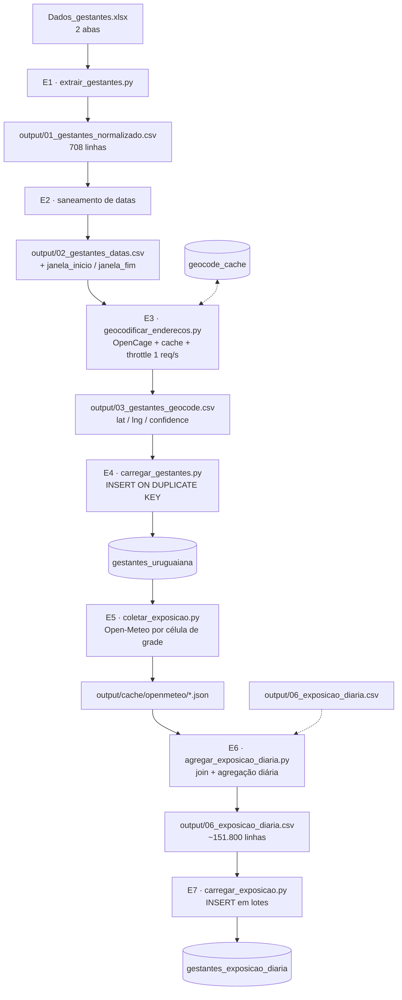
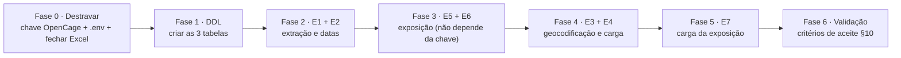

# Planejamento — Pipeline Gestantes Uruguaiana/RS

> Ingestão de `Dados_gestantes.xlsx` → geocodificação (OpenCage) → exposição ambiental
> (Open-Meteo: PM10, PM2.5 e temperatura) → MySQL `datasaude`.

**Data do planejamento:** 2026-09-17
**Arquivo de entrada:** `/Users/cauebeloni/Documents/Projeto Pensi/dados/uruguaiana-rs/Dados_gestantes.xlsx`
**Destino:** MySQL 8.0.37 (`datasaude`) via `core/database.py`
**Documentos relacionados:** `create_table_gestantes_uruguaiana.sql`, `create_table_gestantes_exposicao_diaria.sql`, `create_table_geocode_cache.sql`

---

## 1. Objetivo

1. Ler as **2 abas** do arquivo Excel e unificar em um único conjunto de gestantes.
2. Acrescentar uma **coluna de grupo** identificando a aba de origem de cada registro.
3. **Geocodificar** o endereço de cada registro via API OpenCage, persistindo
   `latitude`, `longitude`, `confidence` e `formatted`.
4. Para cada registro, recuperar os **9 meses de exposição** imediatamente anteriores
   à data de referência: `pm10`, `pm2_5` (Open-Meteo Air Quality) e `temperature_2m`
   (Open-Meteo Archive), **agregados por dia**.
5. Persistir em duas tabelas relacionadas no MySQL.

---

## 2. Diagnóstico do arquivo de entrada

### 2.1 Estrutura

| Aba | Registros | ID | Coluna do endereço |
|---|---|---|---|
| `Grupo1` | 504 | `Form1_1` … `Form1_504` | `Localização/endereço` |
| `Grupo_2` | 204 | `Form2_1` … `Form2_204` | `Endereço/localização` |
| **Total** | **708** | | |

Ambas as abas têm exatamente 4 colunas, na mesma ordem, mas com **cabeçalhos
diferentes na 4ª coluna** — é obrigatório ler por **posição** (ou mapear os nomes),
nunca concatenar por nome de coluna.

| # | `Grupo1` | `Grupo_2` | Tipo |
|---|---|---|---|
| 0 | `ID_Gestantes` | `ID_Gestantes` | texto (`FormN_M`) |
| 1 | `Carimbo de data/hora` | `Carimbo de data/hora` | datetime (submissão) |
| 2 | `Data da Coleta: ` | `Data da Coleta: ` | data mista (**há sujeira**) |
| 3 | `Localização/endereço` | `Endereço/localização` | texto livre (**há sujeira**) |

### 2.2 Qualidade dos endereços

| Métrica | Valor |
|---|---|
| Total de registros | 708 |
| Sem endereço utilizável | **154** (21,8%) |
| Com endereço | 554 |
| Endereços únicos utilizáveis | **548** (547 após normalização) |

Valores que devem ser tratados como “sem endereço” (comparação em maiúsculas, com `strip`):

| Valor literal | Ocorrências |
|---|---|
| `NÃO APARECE NO CELK` | 133 |
| `SEM ENDEREÇO` | 16 |
| `SEM DADOS RECENTES` | 3 |
| `nan` / vazio | 2 |

Outras observações sobre os endereços:

- **Nenhum registro contém CEP.** O CEP terá de vir do retorno do OpenCage.
- 14 endereços **não citam Uruguaiana** — muitos são bairros/loteamentos do próprio
  município (`Ipiranga`, `Tabajara Brites`, `Cabo Luís Quevedo`, `União das Vilas`,
  `São João`, `Nova Esperança`, `Cidade Nova`, `Proficar`, `Barragem Sanchuri`…),
  mas há casos de **outro município** (`BARRA DO QUARAÍ`). É obrigatório anexar
  `, URUGUAIANA, RS, BRASIL` apenas quando o texto não contiver município conhecido.
- Vários endereços são referências de loteamento rural (`QUADRA G, 601`, `RODOVIA BR-472 581/581`,
  `QUADRA DEZ, 24`) — historicamente geocodificam com **baixa confiança** ou não
  geocodificam. Precisam de tratamento explícito de falha.
- Diferenças de grafia: `URGUAIANA` (typo), `RUA RUA MARECHAL DEODORO` (duplicação),
  separadores mistos (`.`, `-`, `;`).

### 2.3 Qualidade das datas (`Data da Coleta: `)

O campo é `object` no pandas (mistura `datetime` e `str`) → **exige `errors="coerce"`**.

| ID | Valor registrado | Carimbo (submissão) | Problema | Correção |
|---|---|---|---|---|
| `Form1_59` | `1/8/1024` | 2024-02-09 | ano inválido (não parseia) | ano `1024` → `2024`; divirge > 30 d do carimbo → usar carimbo |
| `Form1_120` | `3024-03-25` | 2024-03-25 | ano inválido (não parseia) | ano `3024` → `2024` (= carimbo ✔) |
| `Form2_199` | `2004-06-01` | 2025-06-01 | ano fora da faixa | divergência de 7.670 d → usar carimbo |
| `Form1_64` | 2023-02-10 | 2024-02-10 | −365 d | usar carimbo |
| `Form1_149` | 2023-04-06 | 2024-04-06 | −366 d | usar carimbo |
| `Form2_23`, `Form2_24` | 2024-02-23 | 2025-02-23 | −366 d | usar carimbo |
| `Form2_39`, `Form2_53`, `Form2_76` | 2024-03-* | 2025-03-* | −365 d | usar carimbo |
| `Form1_104` | 2024-09-20 | 2024-03-20 | +184 d | usar carimbo |
| `Form1_426` | 2024-05-06 | 2024-11-06 | −184 d | usar carimbo |
| `Form1_262` | 2024-03-04 | 2024-06-04 | −92 d | usar carimbo |
| `Form1_315` | 2024-04-23 | 2024-07-23 | −91 d | usar carimbo |
| `Form1_222`, `Form1_247` | 2024-06-* | 2024-05-* | +31 d | manter (tolerância) |
| `Form1_344/345/347`, `Form1_419`, `Form2_18`, `Form2_122` | — | — | ±31 d | manter (tolerância) |

**Resumo:** 708 registros · **22 exigem correção ou fallback** (3,1%) · 686 estão OK.
Faixa final de `data_referencia`: **2023-02-10 → 2025-06-01**.

### 2.4 Cobertura das APIs (verificado em 2026-09-17)

| API | Início histórico | Fim | Observação |
|---|---|---|---|
| Air Quality (CAMS) | **~2022-07-29** | atual | antes disso retorna `null` (HTTP 200) |
| Archive (ERA5) | 1940 | D−5 | cobertura total no período |

Impacto: **2 registros** têm janela iniciando antes de 2022-07-29 → dias com
`pm10`/`pm2_5` nulos.

| Registro | Início da janela | Dias sem PM |
|---|---|---|
| `Form1_64` | 2022-05-10 | 80 |
| `Form1_149` | 2022-07-06 | 23 |

Como esses dois já são casos de `FALLBACK_CARIMBO` (§2.3), a janela deles muda e o
impacto real precisa ser reavaliado após a Etapa 2.

### 2.5 Timezone — ponto crítico

Os JSONs de referência em `dados/uruguaiana-rs/` demonstram o problema:

| Arquivo | `utc_offset_seconds` | `timezone` |
|---|---|---|
| `poluicao.json` | `0` | **GMT** ← requisição sem `timezone` |
| `temperatura.json` | `-10800` | America/Sao_Paulo |

Sem o parâmetro `timezone`, a **Air Quality API devolve horários em GMT** e a Archive
em GMT também. Misturar as duas séries produziria **desalinhamento de 3 horas** na
agregação diária (e ~3 dias de borda errados no início/fim da janela).

> **Decisão obrigatória:** enviar `timezone=America%2FSao_Paulo` em **todas** as
> chamadas Open-Meteo. A API devolve `utc_offset_seconds: -10800` e horários locais.

### 2.6 Bloqueios identificados

| # | Bloqueio | Impacto | Ação necessária |
|---|---|---|---|
| B1 | **A chave OpenCage está inválida.** Teste real: HTTP 401 / `{"status":{"code":401,"message":"unknown API key"}}` | Etapas 3 e 4 não executam | Usuário deve fornecer chave válida |
| B2 | `.env` **não possui** a chave `open_cage_api_key`, mas `geolocalizacao/get_coordenadas.py` a referencia | `KeyError` ao rodar o script existente | Adicionar `open_cage_api_key=<chave>` ao `.env` |
| B3 | A aba `Grupo_2` estava aberta no Excel (`.~lock.Dados_gestantes.xlsx#`) | Leitura pode falhar/desatualizar | Fechar o arquivo antes de executar |

---

## 3. Decisões de projeto (validadas com o usuário)

| Tema | Decisão |
|---|---|
| **Janela temporal** | 9 meses **antes** da data de coleta: `[data_referencia − 9 meses, data_referencia]` (274 dias em média, 273–276) |
| **Granularidade** | **Diária agregada** — 1 linha por (gestante, dia) |
| **Data-âncora** | `Data da Coleta` com saneamento; fallback em `Carimbo de data/hora` |
| **Registros sem endereço** | **São inseridos** com `latitude`/`longitude` nulos e `geo_status = 'SEM_ENDERECO'` |
| **Destino** | MySQL do projeto (`.env`) |

**Consequência da granularidade diária:** ~554 registros com endereço × ~274 dias ≈
**151.800 linhas** em `gestantes_exposicao_diaria`.

**Derivação dos meses:** usar `dateutil.relativedelta(months=9)`, não `9 × 30 dias`
— o calendário produz 273–276 dias e é o correto epidemiologicamente.

---

## 4. Arquitetura do pipeline



Cada etapa lê um CSV/JSON da etapa anterior e grava o seu próprio. Isso torna o
pipeline **retomável**: uma falha na Etapa 5 não obriga a repetir a geocodificação.

---

## 5. Especificação das tabelas

> DDLs prontos e sintaticamente validados em §5.4. Basta executá-los nesta ordem:
> `gestantes_uruguaiana` → `gestantes_exposicao_diaria` → `geocode_cache`
> (a segunda depende da primeira por causa da FK).

### 5.1 `gestantes_uruguaiana` — registro da gestante

Uma linha por gestante. `UNIQUE (grupo, id_externo)` torna a carga idempotente.

| Coluna | Tipo | Nulo | Descrição |
|---|---|---|---|
| `id` | `int` AI | PK | Chave técnica |
| `id_externo` | `varchar(50)` | não | `Form1_1`, `Form2_204`… |
| `grupo` | `varchar(20)` | não | **NOVA COLUNA** — `Grupo1` / `Grupo_2` |
| `origem_arquivo` | `varchar(255)` | sim | Caminho do `.xlsx` |
| `carimbo_data_hora` | `datetime` | não | Timestamp de submissão do formulário |
| `data_coleta_original` | `varchar(50)` | sim | Valor cru, para auditoria |
| `data_coleta` | `date` | sim | Data de coleta saneada |
| `data_referencia` | `date` | não | Data-âncora da janela (coleta ou fallback) |
| `data_status` | `varchar(30)` | não | `OK` / `CORRIGIDA` / `FALLBACK_CARIMBO` / `INVALIDA` |
| `janela_inicio` | `date` | não | `data_referencia − 9 meses` |
| `janela_fim` | `date` | não | `= data_referencia` |
| `dias_janela` | `smallint` | não | 273–276 |
| `endereco_original` | `varchar(1000)` | sim | Texto cru do Excel |
| `endereco_normalizado` | `varchar(1000)` | sim | Texto enviado à API |
| `endereco_hash` | `char(40)` | sim | SHA1 do normalizado → chave do cache |
| `latitude` | `decimal(10,7)` | sim | **Do OpenCage** |
| `longitude` | `decimal(10,7)` | sim | **Do OpenCage** |
| `geo_confianca` | `tinyint` | sim | Campo `confidence` (0–10) |
| `geo_formatado` | `varchar(500)` | sim | Campo `formatted` |
| `geo_status` | `varchar(30)` | não | `OK` / `BAIXA_CONFIANCA` / `NAO_ENCONTRADO` / `SEM_ENDERECO` / `ERRO_API` / `PENDENTE` |
| `geo_provider` | `varchar(50)` | sim | `opencage` |
| `geo_city` | `varchar(100)` | sim | `components.city` |
| `geo_state` | `varchar(50)` | sim | `components.state_code` |
| `geo_country` | `varchar(50)` | sim | `components.country_code` |
| `geo_postcode` | `varchar(20)` | sim | `components.postcode` |
| `geo_suburb` | `varchar(100)` | sim | `components.suburb` |
| `geo_data_hora` | `datetime` | sim | Quando a geocodificação ocorreu |
| `grade_ar_latitude` | `decimal(10,7)` | sim | Ponto de grade efetivo devolvido pela Air Quality API |
| `grade_ar_longitude` | `decimal(10,7)` | sim | idem |
| `grade_meteo_latitude` | `decimal(10,7)` | sim | Ponto de grade efetivo devolvido pela Archive API |
| `grade_meteo_longitude` | `decimal(10,7)` | sim | idem |
| `exposicao_status` | `varchar(30)` | sim | `COMPLETA` / `PARCIAL` / `SEM_COBERTURA` / `NAO_COLETADA` |
| `dias_com_exposicao` | `smallint` | sim | Dias com dado válido gravados |
| `validado` | `tinyint(1)` | não | Revisão manual (padrão `0`) |
| `data_criacao` / `data_alteracao` | `timestamp` | sim | Auditoria |

Índices: `UNIQUE (grupo, id_externo)`, `KEY (data_referencia)`, `KEY (geo_status)`,
`KEY (endereco_hash)`.

### 5.2 `gestantes_exposicao_diaria` — exposição ambiental

Uma linha por (gestante, dia). `UNIQUE (id_gestante, data)` → idempotente.

| Coluna | Tipo | Descrição |
|---|---|---|
| `id` | `bigint` AI | PK (volume > 150 mil) |
| `id_gestante` | `int` | FK → `gestantes_uruguaiana.id` |
| `grupo` | `varchar(20)` | Desnormalizado para consultas sem join |
| `id_externo` | `varchar(50)` | Desnormalizado |
| `data` | `date` | Dia calendário (America/Sao_Paulo) |
| `dia_relativo` | `smallint` | `(data − data_referencia)` em dias, de `−274` a `0` |
| `mes_relativo` | `tinyint` | `1` a `9` (mês 9 = mais próximo da coleta) |
| `pm10_media` / `_min` / `_max` | `decimal(8,3)` | µg/m³ |
| `pm10_horas_validas` | `tinyint unsigned` | 0–24 |
| `pm2_5_media` / `_min` / `_max` | `decimal(8,3)` | µg/m³ |
| `pm2_5_horas_validas` | `tinyint unsigned` | 0–24 |
| `temperatura_media` / `_min` / `_max` | `decimal(6,2)` | °C |
| `temperatura_horas_validas` | `tinyint unsigned` | 0–24 |
| `valido` | `tinyint(1)` | `1` se as 3 variáveis têm ≥ 18 h válidas |
| `data_criacao` | `timestamp` | Auditoria |

Índices: `UNIQUE (id_gestante, data)`, `KEY (data)`, `KEY (id_gestante, dia_relativo)`,
FK `id_gestante → gestantes_uruguaiana(id)`.

> **`mes_relativo`** pressupõe que a coleta ocorre ao final do período de 9 meses.
> Não representa idade gestacional real (não há DUM/DPP na planilha).

### 5.3 `geocode_cache` — cache permanente de geocodificação

Evita repetir chamadas para os 547 endereços únicos e protege contra reexecução.
A OpenCage **exige** armazenamento permanente dos resultados.

| Coluna | Tipo | Descrição |
|---|---|---|
| `id` | `int` AI | PK |
| `endereco_hash` | `char(40)` | SHA1 do endereço normalizado |
| `endereco_original` | `varchar(1000)` | Texto cru |
| `endereco_consultado` | `varchar(1000)` | Texto efetivamente enviado |
| `provider` | `varchar(50)` | `opencage` |
| `status` | `varchar(30)` | Mesmos valores de `geo_status` |
| `latitude` / `longitude` | `decimal(10,7)` | Coordenadas |
| `confianca` | `tinyint` | `confidence` |
| `formatado` | `varchar(500)` | `formatted` |
| `componentes` | `json` | Objeto `components` completo |
| `resposta_bruta` | `json` | JSON integral (auditoria) |
| `tentativas` | `tinyint unsigned` | Nº de tentativas |
| `data_criacao` / `data_alteracao` | `timestamp` | Auditoria |

Índice: `UNIQUE (endereco_hash, provider)`.
### 5.4 Validação dos DDLs

Os três scripts foram **validados contra o MySQL 8.0.37 real** em 2026-09-17, sem
persistir nada (uso de `CREATE TEMPORARY TABLE` e teste semântico da FK):

| Arquivo | Colunas | Índices | Resultado |
|---|---|---|---|
| `create_table_gestantes_uruguaiana.sql` | 36 | 5 | OK |
| `create_table_gestantes_exposicao_diaria.sql` | 21 | 5 | OK (FK válida) |
| `create_table_geocode_cache.sql` | 15 | 3 | OK |

A validação da FK usa o erro `1824` (*Failed to open the referenced table*) como
prova de sintaxe correta — é um erro semântico, emitido **depois** do parse.
Uma verificação posterior confirmou `SHOW TABLES LIKE 'gestantes%'` vazio:
**nenhum objeto foi criado**.
---

## 6. Etapas detalhadas

### E1 · Extração e unificação

**Script:** `extrair_gestantes.py`
**Entrada:** `Dados_gestantes.xlsx`, abas `["Grupo1", "Grupo_2"]`
**Saída:** `output/01_gestantes_normalizado.csv` (708 linhas)

1. `pd.read_excel(..., sheet_name=None)` para ler todas as abas.
2. Para **cada** aba, renomear por **posição** para o schema canônico:
   `["id_externo", "carimbo_data_hora", "data_coleta_original", "endereco_original"]`.
3. Anexar `grupo = nome_da_aba` (a **nova coluna** exigida).
4. `pd.concat(..., ignore_index=True)` → 708 linhas.
5. Validações: 2 abas presentes; 4 colunas cada; `id_externo` único por grupo;
   nenhum `id_externo` nulo.
6. Não descartar nada — registros sem endereço seguem no fluxo.

### E2 · Saneamento de datas

**Script:** `sanitizar_datas.py` (ou função em `extrair_gestantes.py`)
**Entrada:** CSV 01 → **Saída:** `output/02_gestantes_datas.csv`

```python
STOP_ADDRESS = {"NAN", "", "SEM ENDEREÇO", "NÃO APARECE NO CELK",
                "NAO APARECE NO CELK", "SEM DADOS RECENTES"}
TOLERANCIA_DIAS = 30

def sanear_data(valor_cru, carimbo):
    """Retorna (data_coleta, data_referencia, data_status)."""
    # 1. tentativa direta
    dt = pd.to_datetime(valor_cru, errors="coerce")
    status = "OK"

    # 2. reparo do ano de 4 dígitos (>2100 subtrai 1000; <1950 soma 1000)
    if pd.isna(dt):
        ano = re.search(r"\b(\d{4})\b", str(valor_cru))
        if ano:
            y = int(ano.group(1))
            y_fix = y - 1000 if y > 2100 else (y + 1000 if y < 1950 else None)
            if y_fix:
                dt = pd.to_datetime(str(valor_cru).replace(ano.group(1), str(y_fix)),
                                    errors="coerce")
                status = "CORRIGIDA"

    # 3. fallback
    if pd.isna(dt):
        return None, carimbo.normalize(), "INVALIDA"

    # 4. outlier temporal
    if abs((dt - carimbo.normalize()).days) > TOLERANCIA_DIAS:
        return dt, carimbo.normalize(), "FALLBACK_CARIMBO"

    return dt, dt, status
```

Depois: `janela_inicio = data_referencia − relativedelta(months=9)`,
`janela_fim = data_referencia`, `dias_janela = (janela_fim − janela_inicio).days`.

> Aplicar o `FALLBACK_CARIMBO` **antes** de calcular a janela. Com isso, `Form1_64` e
> `Form1_149` passam a ter janelas em 2023-05→2024-02 e 2023-07→2024-04, eliminando o
> problema de cobertura do CAMS descrito em §2.4.

### E3 · Geocodificação

**Script:** `geocodificar_enderecos.py`
**Entrada:** CSV 02 → **Saída:** CSV 03 + tabela `geocode_cache`

**Normalização (`normalizar_endereco`)**

| # | Regra | Exemplo |
|---|---|---|
| 1 | `strip` + colapsar espaços múltiplos | `RUA  D  S/N` → `RUA D S/N` |
| 2 | Maiúsculas e remoção de acentos na chave de cache | `Ipiranga` → `IPIRANGA` |
| 3 | Substituir `.` `;` por `,`; remover `,` finais/duplicados | `601. URUGUAIANA` → `601, URUGUAIANA` |
| 4 | Colapsar duplicações de logradouro | `RUA RUA MARECHAL` → `RUA MARECHAL` |
| 5 | Corrigir `URGUAIANA` → `URUGUAIANA`, `IMBAA` → `IMBAÁ` | |
| 6 | Se não contiver `URUGUAIANA` nem município vizinho conhecido → anexar `, URUGUAIANA, RS` | `QUADRA DOIS, 8` → `QUADRA DOIS, 8, URUGUAIANA, RS` |
| 7 | Anexar `, BRASIL` se ausente | |
| 8 | `endereco_hash = sha1(normalizado)` | 40 chars |

**Chamada**

```
GET https://api.opencagedata.com/geocode/v1/json
      ?key={OPEN_CAGE_API_KEY}
      &q={endereco_normalizado_urlencoded}
      &language=pt-BR          # rótulos em português
      &countrycode=br          # restringe a busca ao Brasil
      &limit=1                 # reduz payload; usamos sempre results[0]
      &no_annotations=1        # remove o bloco "annotations" (economiza banda)
      &abbrv=1                 # remove campos vazios
```

**Campos extraídos** (de `results[0]`, conforme solicitado):

| Campo no response | Coluna |
|---|---|
| `geometry.lat` | `latitude` |
| `geometry.lng` | `longitude` |
| `confidence` | `geo_confianca` |
| `formatted` | `geo_formatado` |
| `components.city` | `geo_city` |
| `components.state_code` | `geo_state` |
| `components.country_code` | `geo_country` |
| `components.postcode` | `geo_postcode` |
| `components.suburb` | `geo_suburb` |
| `rate.remaining` | apenas log de monitoramento |

**Regras de status**

| Condição | `geo_status` |
|---|---|
| `results` vazio | `NAO_ENCONTRADO` |
| `confidence >= 7` **e** `country_code == "br"` | `OK` |
| `confidence` entre 3 e 6, **ou** `state_code != "RS"` | `BAIXA_CONFIANCA` |
| `confidence < 3` | `NAO_CONFIRMADO` |
| HTTP 401/402/429 ou `status.code != 200` | `ERRO_API` |
| Endereço em `STOP_ADDRESS` | `SEM_ENDERECO` (não chama a API) |

**Controle de acesso e resiliência**

- **Cache obrigatório:** consultar `geocode_cache` por `(endereco_hash, provider)`
  antes de qualquer chamada. Se existir com status definitivo, reutilizar.
- **Deduplicação:** apenas **547** chamadas reais (endereços únicos), não 554.
- **Throttle:** pausa de **1,1 s** entre chamadas (limite de 1 req/s da OpenCage).
  Tempo estimado: **~10 minutos**.
- **Retry:** backoff exponencial (2 s, 4 s, 8 s) para `429`/`5xx`, máximo 3 tentativas.
- **Quota:** abortar o lote com aviso se `rate.remaining < 50`.
- **Erros:** nunca interromper o lote inteiro por um endereço — gravar `ERRO_API` e seguir.
- **Chave:** ler de `os.getenv("OPEN_CAGE_API_KEY")` / `.env`, **nunca** hardcoded.

### E4 · Carga de `gestantes_uruguaiana`

**Script:** `carregar_gestantes.py`

- Conexão via `core/database.criar_conexao()` (padrão do projeto).
- `INSERT ... ON DUPLICATE KEY UPDATE` sobre `(grupo, id_externo)` → reexecutável.
- Lotes de 500 linhas, com `executemany` e `commit` por lote.
- Converter `NaT`/`NaN` → `None` (o driver mysql não aceita `NaN`).
- Ao final, recuperar o mapa `(grupo, id_externo) → id` para alimentar a Etapa 7.

### E5 · Coleta na Open-Meteo

**Script:** `coletar_exposicao.py`
**Saída:** `output/cache/openmeteo/{air|archive}_{lat}_{lng}_{ini}_{fim}.json`

**Otimização central — deduplicação por célula de grade.**
A Open-Meteo não interpola: devolve os dados do **ponto de grade** mais próximo.

| API | Resolução observada | Exemplo |
|---|---|---|
| Air Quality (CAMS) | ~0,1° (~11 km) | pedido `-29.7599/-57.0899` → devolvido `-29.8/-57.1` |
| Archive (ERA5) | ~0,25° | pedido `-29.7599/-57.0899` → devolvido `-29.77153/-57.07315` |

Portanto:

1. Agrupar os endereços geocodificados por `round(latitude, 1)` + `round(longitude, 1)`.
2. Para **cada chave única**, fazer **1 requisição por API** cobrindo o intervalo
   global `[min(janela_inicio), max(janela_fim)]` = **2022-05-10 → 2025-06-01**.
3. Guardar o `latitude`/`longitude` **efetivamente devolvidos** — é o ponto de grade real.
4. Se dois pontos distintos caírem na mesma célula, o segundo reaproveita o JSON.

| Cenário | Requisições |
|---|---|
| Sem deduplicação | 554 × 2 = **1.108** |
| **Com deduplicação (estimativa)** | **~5 a 15 por API** |

**URLs**

```
# Qualidade do ar — PM10 e PM2.5
https://air-quality-api.open-meteo.com/v1/air-quality
  ?latitude={lat}&longitude={lng}
  &start_date=2022-05-10&end_date=2025-06-01
  &hourly=pm10,pm2_5
  &timezone=America%2FSao_Paulo          # ← obrigatório (§2.5)

# Temperatura
https://archive-api.open-meteo.com/v1/archive
  ?latitude={lat}&longitude={lng}
  &start_date=2022-05-10&end_date=2025-06-01
  &hourly=temperature_2m
  &timezone=America%2FSao_Paulo          # ← obrigatório
```

**Estrutura da resposta** (`hourly`): arrays paralelos de 26.304 posições (3 anos horários):
`time[]` (ISO local), `pm10[]`, `pm2_5[]`, `temperature_2m[]`. Valores ausentes = `null`.

Validação de cada resposta: `hourly.time` presente e com comprimento esperado;
`utc_offset_seconds == -10800`; registrar `elevation` e `timezone`.

### E6 · Agregação diária

**Script:** `agregar_exposicao_diaria.py`
**Saída:** `output/06_exposicao_diaria.csv` (~151.800 linhas)

1. Carregar os JSONs em cache → `DataFrame` com índice `DatetimeIndex` (local).
2. Para cada gestante **com coordenada**:
   - selecionar o JSON do seu ponto de grade (air + archive);
   - **cortar** a janela `[janela_inicio, janela_fim]` — `df.loc[ini:fim]`;
   - `resample("D")` e calcular `mean`, `min`, `max` e `count` (nº de valores não nulos);
   - preencher `dia_relativo`, `mes_relativo`, `valido`.
3. Regra de validade: `valido = 1` somente se as 3 variáveis tiverem **≥ 18 horas
   válidas** (75% do dia). Dias abaixo disso são gravados com `valido = 0`,
   preservando `*_horas_validas` para que o analista decida.
4. Gestantes **sem endereço**: nenhuma linha gerada; `exposicao_status = 'NAO_COLETADA'`.
5. Gestantes com dias faltantes: `exposicao_status = 'PARCIAL'`.

> **Vetorização:** iterar por **célula de grade** (não por gestante) e aplicar o
> `resample` uma vez por célula, depois fazer `merge` com as gestantes daquela célula.
> Isso reduz ~550 `resample`s para ~10.

### E7 · Carga de `gestantes_exposicao_diaria`

**Script:** `carregar_exposicao.py`

- `INSERT ... ON DUPLICATE KEY UPDATE` sobre `(id_gestante, data)`.
- Lotes de 5.000 linhas (`executemany`), `commit` por lote — ~31 lotes.
- Desabilitar `autocommit` durante a carga; medir tempo e linhas/s.
- Atualizar `exposicao_status` e `dias_com_exposicao` em `gestantes_uruguaiana` ao final.

---

## 7. Estrutura de arquivos proposta

```
uruguaiana/
├── PLANEJAMENTO.md                              ← este documento
├── create_table_gestantes_uruguaiana.sql        ← DDL tabela 1
├── create_table_gestantes_exposicao_diaria.sql  ← DDL tabela 2
├── create_table_geocode_cache.sql               ← DDL tabela 3
├── __init__.py
├── config_uruguaiana.py        # constantes: caminhos, abas, STOP_ADDRESS,
│                               #   tolerâncias, URLs e parâmetros das APIs
├── extrair_gestantes.py        # E1 + E2 (extração, unificação, saneamento)
├── geocode_client.py           # E3 (OpenCage: cache, throttle, retry, status)
├── openmeteo_client.py         # E5 (air-quality + archive, cache em disco)
├── agregar_exposicao.py        # E6 (resample diário, janelas, flags)
├── repositorio.py              # E4 + E7 (upserts MySQL, conexão do projeto)
├── run_pipeline.py             # CLI: --etapa 1|2|3|4|5|6|7|todas  --force
└── output/
    ├── 01_gestantes_normalizado.csv
    ├── 02_gestantes_datas.csv
    ├── 03_gestantes_geocode.csv
    ├── 06_exposicao_diaria.csv
    ├── pendencias_geocode.csv      # endereços sem resultado, para revisão manual
    ├── pendencias_datas.csv        # registros com data corrigida/fallback
    └── cache/openmeteo/*.json
```

`run_pipeline.py` deve expor etapas independentes para permitir retomar de onde parou:

```bash
.venv/bin/python uruguaiana/run_pipeline.py --etapa 1
.venv/bin/python uruguaiana/run_pipeline.py --etapa 3 --force   # ignora cache
.venv/bin/python uruguaiana/run_pipeline.py --todas
```

---

## 8. Idempotência, cache e reexecução

| Mecanismo | Onde | Efeito |
|---|---|---|
| `UNIQUE (grupo, id_externo)` + upsert | E4 | Reexecutar não duplica gestantes |
| `UNIQUE (id_gestante, data)` + upsert | E7 | Reexecutar não duplica exposição |
| `geocode_cache` por SHA1 | E3 | Nunca repete chamada paga |
| JSONs em `cache/openmeteo/` | E5 | Nunca repete requisição de série temporal |
| CSVs intermediários por etapa | E1–E6 | Retomada sem reprocessar tudo |
| `--force` | CLI | Ignora cache deliberadamente |

---

## 9. Riscos e mitigações

| # | Risco | Prob. | Impacto | Mitigação |
|---|---|---|---|---|
| R1 | **Chave OpenCage inválida** (bloqueio B1) | Confirmado | Alto — bloqueia E3 | Obter chave válida; pipeline roda E1–E2 e E5–E7 offline enquanto isso |
| R2 | Timezone divergente entre as duas APIs (§2.5) | Alta se ignorado | Alto — 3 h de desalinhamento | `timezone=America/Sao_Paulo` em ambas; validar `utc_offset_seconds` |
| R3 | Endereços rurais/loteamento não geocodificam | Alta | ~15–25% dos endereços | `geo_status` explícito + `pendencias_geocode.csv`; não abortar o lote |
| R4 | CAMS sem dados antes de 2022-07-29 (§2.4) | Confirmado | Baixo — poucos dias | Documentar em `exposicao_status`; `*_horas_validas` permite excluir |
| R5 | Resolução de grade grosseira (11–25 km) | Inerente | Médio — erro de exposição | Persistir o ponto de grade real; documentar no metadado do estudo |
| R6 | Quota OpenCage (2.500/dia) | Baixa — 547 chamadas | — | Throttle 1 req/s; aborta se `remaining < 50` |
| R7 | 151.800 linhas → carga lenta | Média | Médio | Lotes de 5.000 + `executemany`; índice único para checagem |
| R8 | Arquivo Excel aberto (`.~lock`) | Média | Baixo | Fechar antes de rodar; `try/except` com mensagem clara |
| R9 | Chave de API exposta em texto plano | Média | Alto | Mover para `.env` (`.gitignore`) e **rotacionar** a chave atual |

---

## 10. Critérios de aceite

- [ ] `SELECT COUNT(*) FROM gestantes_uruguaiana` = **708**
- [ ] `SELECT grupo, COUNT(*) ... GROUP BY grupo` = `Grupo1` **504** / `Grupo_2` **204**
- [ ] Nenhum `(grupo, id_externo)` duplicado
- [ ] Registros com `geo_status = 'SEM_ENDERECO'` = **154**
- [ ] Nenhum registro com `latitude` nula e `geo_status` em (`OK`, `BAIXA_CONFIANCA`)
- [ ] Registros com `data_status <> 'OK'` = **22** e conferem com a §2.3
- [ ] `dias_janela` entre 273 e 276 para 100% das linhas
- [ ] `data_referencia` dentro de `2023-02-10 … 2025-06-01`
- [ ] `COUNT(*)` em `gestantes_exposicao_diaria` ≈ **151.800** (± 2%)
- [ ] Toda `gestantes_exposicao_diaria.data` está em `[janela_inicio, janela_fim]` da sua gestante
- [ ] `dia_relativo` sempre ≤ 0 e ≥ −276
- [ ] `MIN(*_horas_validas) >= 0` e `MAX(*) <= 24`
- [ ] Nenhum registro em `gestantes_exposicao_diaria` com `latitude` nula na gestante
- [ ] `SELECT COUNT(*) FROM gestantes_uruguaiana WHERE exposicao_status IS NULL` = **154** (os sem endereço)
- [ ] Reexecutar `--todas` não altera nenhuma contagem (idempotência)
- [ ] Nenhuma chamada duplicada ao OpenCage em reexecução (auditar `geocode_cache.tentativas` = 1)

---

## 11. Ordem de execução sugerida



**Por que essa ordem:** as Etapas 5 e 6 usam apenas as coordenadas e as datas — não
dependem da OpenCage para *coletar* (dependem para *associar*). Se a chave (bloqueio B1)
ainda não estiver disponível, as etapas E1, E2, E5, E6, criação de DDL e toda a
infraestrutura de clientes podem ser implementadas e testadas imediatamente.

---

## 12. Ações imediatas necessárias do usuário

1. **Fornecer uma chave OpenCage válida** — a atual (`8adb…4c43`) retorna HTTP 401.
2. **Adicionar `open_cage_api_key=<chave>` ao `.env`** do projeto
   (`geolocalizacao/get_coordenadas.py` já depende dessa variável).
3. **Fechar `Dados_gestantes.xlsx` no Excel** (há um arquivo de lock).
4. **Rotacionar a chave** que foi compartilhada em texto plano no chat.
5. **Autorizar a criação das 3 tabelas** — os DDLs estão prontos e validados, mas
   nada foi executado no banco.

---

## 13. Notas de implementação (armadilhas conhecidas)

| Armadilha | Detalhe |
|---|---|
| `criar_conexao()` não falha | Faz `while True` com retry infinito e `time.sleep(1)` em caso de erro. Um host errado **trava o script para sempre**. Envolver em timeout ou usar `criar_engine_sqlalchemy()`. |
| `NaN` do pandas no MySQL | O driver rejeita `nan` em colunas numéricas. Converter com `df.where(pd.notna(df), None)`. |
| `np.int64` / `np.bool_` | O driver rejeita tipos numpy. Converter com `int()` / `bool()` antes do `executemany`. |
| `data_coleta: ` tem espaço no nome | O cabeçalho da coluna 3 é `'Data da Coleta: '` (com espaço à direita). Nunca confiar no nome — ler por posição. |
| `concat` das abas | As abas têm nomes diferentes na coluna 4. Renomear **antes** do `concat`, senão o pandas cria colunas extras e **desalinha silenciosamente** os dados (foi exatamente o erro da primeira análise deste planejamento). |
| `;` em `COMMENT` de DDL | Quebra ferramentas que dividem sentenças por `;`. Evitar em literais. |
| OpenCage devolve HTTP 4xx **com corpo JSON** | Sempre checar `status.code` **e** o HTTP status. |
